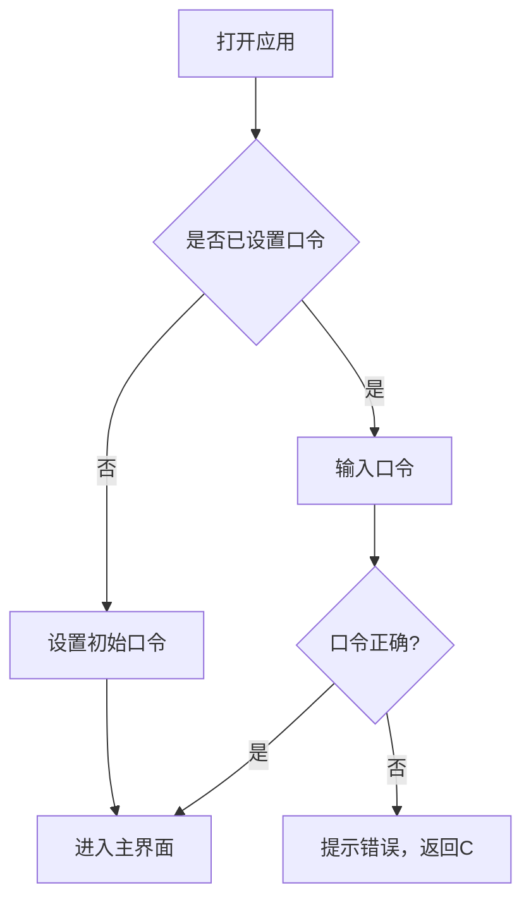
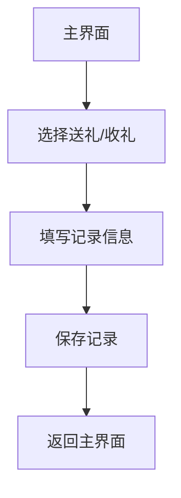
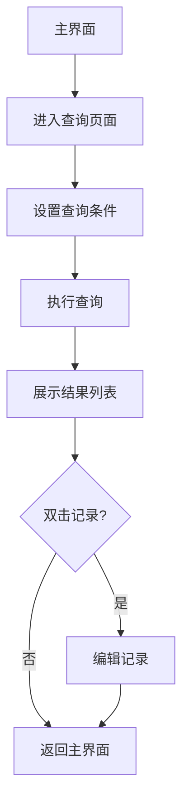

## 1. Product Overview
人情往来记账系统是一款帮助用户管理送礼、收礼等人情往来的记账管理系统，支持数据导入导出、统计分析等功能，适用于华为HarmonyOS系统。
- 帮助用户记录和管理日常人情往来，解决人情账难记、难统计的问题
- 目标用户：需要管理人情往来的普通用户
- 市场价值：提供便捷的人情账管理工具，让用户轻松管理人际关系中的礼尚往来

## 2. Core Features

### 2.1 User Roles
| Role | Registration Method | Core Permissions |
|------|---------------------|------------------|
| 普通用户 | 口令登录 | 使用所有记账功能 |

### 2.2 Feature Module
1. **登录页面**: 口令登录、修改口令
2. **主界面**: 功能菜单入口
3. **记账页面**: 送礼记录、收礼记录
4. **查询页面**: 按条件查询记录
5. **统计页面**: 统计报表展示
6. **导入导出页面**: Excel数据导入导出

### 2.3 Page Details
| Page Name | Module Name | Feature description |
|-----------|-------------|---------------------|
| 登录页面 | 登录模块 | 口令验证、修改口令功能 |
| 主界面 | 功能菜单 | 展示所有功能入口：新建账本、新增记录、查询记录、统计报表、数据导入、数据导出、退出系统 |
| 记账页面 | 送礼记录 | 记录送礼对象、金额、日期、场合、备注 |
| 记账页面 | 收礼记录 | 记录送礼人、金额/物品、日期、场合、备注 |
| 查询页面 | 查询模块 | 按人、日期范围、场合类型查询，支持排序和双击编辑 |
| 统计页面 | 统计模块 | 统计特定对象往来，导出汇总报表 |
| 导入导出页面 | 数据管理 | Excel格式导入导出，数据库备份恢复 |

## 3. Core Process

### 3.1 用户登录流程

### 3.2 记账流程

### 3.3 查询统计流程

## 4. User Interface Design

### 4.1 Design Style
- **Primary Color**: #2563eb (蓝色系，体现稳重可信)
- **Secondary Color**: #16a34a (绿色系，用于成功状态)
- **Button Style**: 圆角矩形，渐变背景，悬停效果
- **Font**: 华为鸿蒙默认字体，清晰易读
- **Layout**: 卡片式布局，简洁明了
- **Icon Style**: 线性图标，统一风格

### 4.2 Page Design Overview
| Page Name | Module Name | UI Elements |
|-----------|-------------|-------------|
| 登录页面 | 登录模块 | 口令输入框、登录按钮、设置口令链接 |
| 主界面 | 功能菜单 | 网格布局的功能按钮，图标+文字 |
| 记账页面 | 表单区域 | 输入框、日期选择器、下拉选择框、提交按钮 |
| 查询页面 | 查询区域 | 筛选条件表单、结果表格、排序功能 |
| 统计页面 | 统计区域 | 统计卡片、图表、导出按钮 |
| 导入导出页面 | 数据管理 | 文件选择器、导入导出按钮、进度提示 |

### 4.3 Responsiveness
- 移动端优先设计，适配手机屏幕
- 触控优化，按钮尺寸适合手指点击
- 响应式布局，适配不同屏幕尺寸

### 4.4 Accessibility
- 文字颜色对比度符合WCAG标准
- 按钮有明确的焦点状态
- 支持屏幕阅读器
