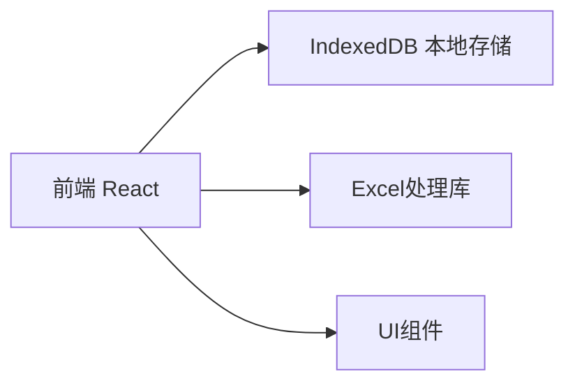
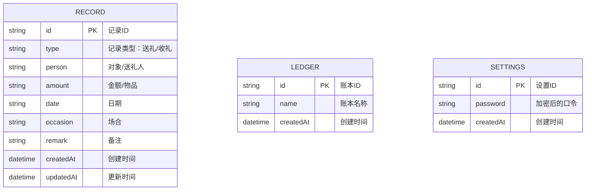

## 1. Architecture Design



## 2. Technology Description

* Frontend: React\@18 + tailwindcss\@3 + vite

* Initialization Tool: vite-init

* Backend: 无（纯前端应用，使用IndexedDB本地存储）

* Database: IndexedDB (浏览器本地数据库)

* Excel处理: xlsx库

* 打包工具: Capacitor (用于构建APK)

## 3. Route Definitions

| Route          | Purpose        |
| -------------- | -------------- |
| /login         | 登录页面，口令验证      |
| /              | 主界面，功能菜单       |
| /record        | 记账页面，添加送礼/收礼记录 |
| /query         | 查询页面，按条件查询记录   |
| /statistics    | 统计页面，展示统计报表    |
| /import-export | 导入导出页面         |

## 4. API Definitions

本应用为纯前端应用，无后端API。所有数据存储在浏览器IndexedDB中。

## 5. Data Model

### 5.1 Data Model Definition



### 5.2 Data Definition Language

#### Record 表（记录）

| Field     | Type   | Description                  |
| --------- | ------ | ---------------------------- |
| id        | string | 主键，UUID                      |
| type      | string | 类型：'send'（送礼）或 'receive'（收礼） |
| person    | string | 送礼对象/收礼人                     |
| amount    | string | 金额或物品描述                      |
| date      | string | 日期，格式：YYYY-MM-DD             |
| occasion  | string | 场合类型                         |
| remark    | string | 备注说明                         |
| createdAt | string | 创建时间戳                        |
| updatedAt | string | 更新时间戳                        |

#### Ledger 表（账本）

| Field     | Type   | Description |
| --------- | ------ | ----------- |
| id        | string | 主键，UUID     |
| name      | string | 账本名称        |
| createdAt | string | 创建时间戳       |

#### Settings 表（设置）

| Field     | Type   | Description      |
| --------- | ------ | ---------------- |
| id        | string | 主键，固定为'settings' |
| password  | string | SHA256加密后的口令     |
| createdAt | string | 创建时间戳            |

## 6. Project Structure

```
src/
├── components/          # 可复用组件
│   ├── Button.tsx       # 按钮组件
│   ├── Input.tsx        # 输入框组件
│   ├── Select.tsx       # 下拉选择组件
│   ├── DatePicker.tsx   # 日期选择组件
│   ├── Table.tsx        # 表格组件
│   └── Card.tsx         # 卡片组件
├── pages/               # 页面组件
│   ├── Login.tsx        # 登录页面
│   ├── Home.tsx         # 主界面
│   ├── Record.tsx       # 记账页面
│   ├── Query.tsx        # 查询页面
│   ├── Statistics.tsx   # 统计页面
│   └── ImportExport.tsx # 导入导出页面
├── stores/              # 状态管理
│   └── appStore.ts      # 应用状态
├── utils/               # 工具函数
│   ├── db.ts            # IndexedDB操作
│   ├── excel.ts         # Excel处理
│   ├── crypto.ts        # 加密工具
│   └── helpers.ts       # 辅助函数
├── types/               # 类型定义
│   └── index.ts         # 类型声明
├── App.tsx              # 主应用组件
├── main.tsx             # 入口文件
└── index.css            # 全局样式
```

## 7. Security Considerations

* 口令使用SHA256加密存储

* 数据仅存储在本地，不上传云端

* 支持数据库备份和恢复功能

